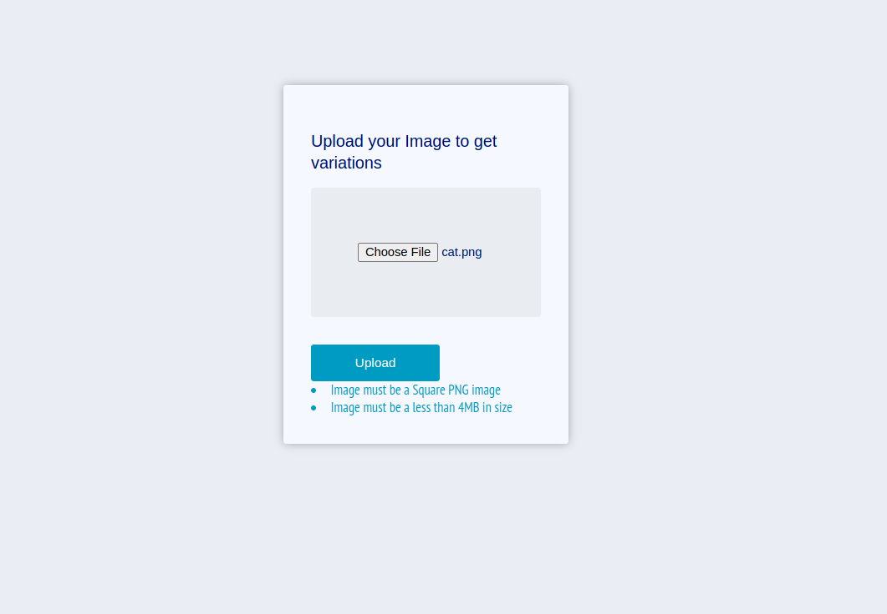
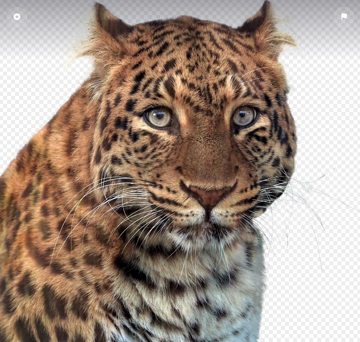
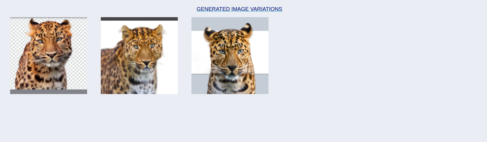
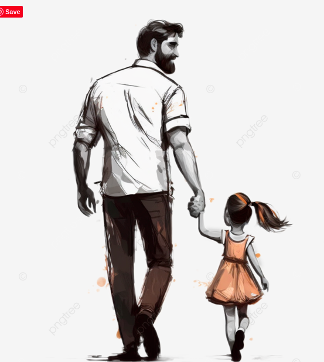
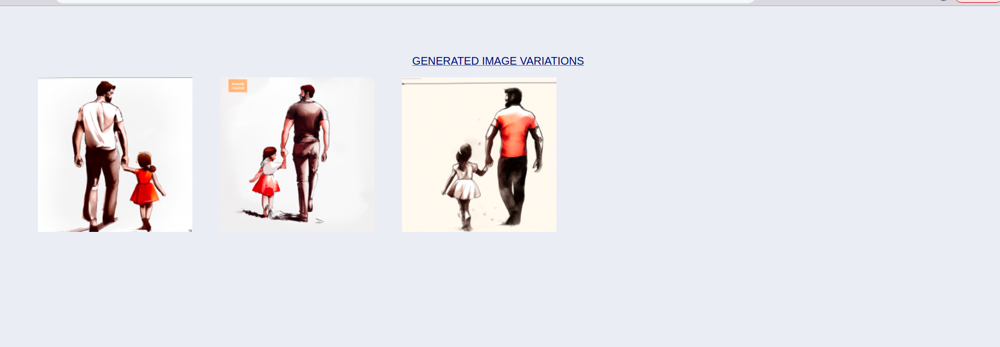

# openai_image_variations_generator
This is a small Django project used to automatically generate variations for an image uploaded by the user. This uses the OpenAI image variation api.

## Tools used
- Python/Django
- OpenAI API

## Setup
- Create an OpenAI account and [Generate an OpenAI API key](https://beta.openai.com/account/api-keys) to be able to access openAI services. 
- Generate a .env file and add API_KEY=GENERATED_API_KEY
- Setup a virtualenv for the project
- Install the dependecies in the requirements.txt file
```
pip installl -r requirements.txt
```
- Run the project
```
python manage.py runserver
```

## Note
- You can only upload a PNG image that is less than 4MB.
- You can change the number of image variations generated by changing the VARIATIONS_NUMBER constant in settings file
- You can change the image quality by changing the IMAGE_SIZE in the settings file. This can be 256(256x256), 512(512x512) and 1024(1024x1024)
- In order for the images to be generated, you will have to [pay for billing](https://beta.openai.com/account/billing/overview) incase your free trial period is over. Without paying for billing, you will not be able to generate any image variations.
An error you'd get related to this:
```
openai.error.InvalidRequestError: Billing hard limit has been reached
```

## Examples

### Home page


### Original image uploaded by user

### Variations produced on page


### Original image uploaded by user


### Variations produced on page


## References

- https://beta.openai.com/docs/introduction

## Authors

- [Genza999](https://www.linkedin.com/in/kisekka-david-a933ba13b/)


## Contributing

- Contributions, issues, and feature requests are welcome!
